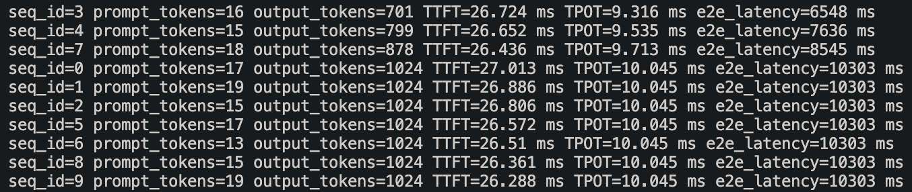
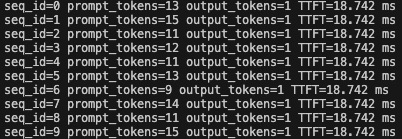
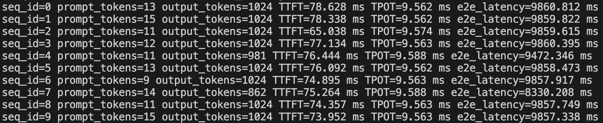
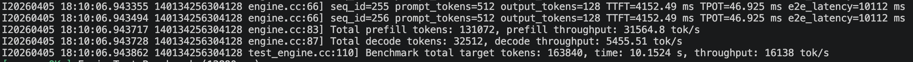
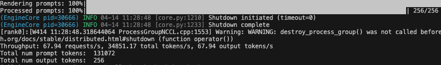
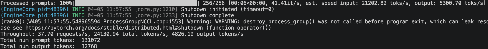

# ginfer: A Lightweight C++ LLM Inference Engine

`ginfer` 是一个基于 C++ 实现的高性能、轻量级 LLM 推理引擎，专注于高效的 KV Cache 管理、批处理推理调度和优化的算子执行路径，旨在提供低延迟和高吞吐量的推理性能。

## Features

- 核心推理路径基于 C++/CUDA 实现，支持 bf16 和 fp16 精度推理。
- 支持 Hugging Face safetensors 格式模型的自动加载，兼容 Qwen2、Llama3 等常见大模型架构。
- 基于 Paged Attention 实现高效的 KV Cache 内存管理，大幅优化长序列推理性能。
- 支持 Continuous Batching，显著提升 Prefill / Decode 阶段的推理吞吐量。

## Architecture

- **core**：底层推理基础设施：
  - `memory`：内存分配器与 buffer 管理。
  - `tensor`：张量类型、shape、dtype 与张量读写能力。
  - `op`：底层算子与 CUDA kernel 封装。
  - `layer`：Embedding、Linear、RMSNorm、Transformer Encoder、FeedForward 等网络层实现。
- **model**：模型抽象与加载逻辑：
  - `Model` / `ModelLoader`：统一模型接口、配置解析与权重加载流程。
  - `AutoTokenizer`：负责 tokenize 与 chat template 处理。
  - `llama3`、`qwen2` 等模型架构的具体实现
- **engine**：推理调度执行引擎，包括：
  - `Engine`：统一推理入口。
  - `ModelRunner` 构造输入张量、位置编码、block tables 和执行上下文。
  - `BlockManager`：为每个Sequence维护 block table，并管理 Paged KV Cache 的分配与复用。
  - `Scheduler`：负责 prefill / decode 阶段连续批处理批处理调度。

## Benchmark

- 测试环境：NVIDIA A40；vllm 0.19.0；CUDA 12.6
- 测试模型：DeepSeek-R1-Distill-Qwen-1.5B

### TTFT/TPOT

NumPrompts=10；MaxOutputLen=1024

* ginfer：AVG_TTFT：26.625 ms；AVG_TPOT：9.888 ms

	
* VLLM：AVG_TTFT：18.742 ms；AVG_TPOT：9.569 ms
  * TTFT 通过设置output_len=1测试

    
  * TPOT (通过serve API测试)

	  

### Prefill/Decode Throughput

NumPrompts=256；InputLen=512；OutputLen=128

* ginfer：Prefill：31590 tok/s；Decode：5457 tok/s (有误，理论上应该比vLLM低)

	
* VLLM：Prefill：34851 toks/s；Decode：4826 toks/s (vllm bench throughput)
  * Prefill 吞吐通过设置output_len=1测试

    
  * Decode 吞吐
  
	  

## Build & Test

1. Build

```bash
mkdir build && cd build
cmake -GNinja -DWITH_CUDA=ON -DCMAKE_BUILD_TYPE=Release ..
ninja
```

### 2. Test

```bash
export MODEL_PATH=/path/to/your/model # hf 模型目录
./bin/test_engine --gtest_filter=EngineTest.Generate # real world chat completion test
./bin/test_engine --gtest_filter=EngineTest.Benchmark # engine throughput benchmark test
```

